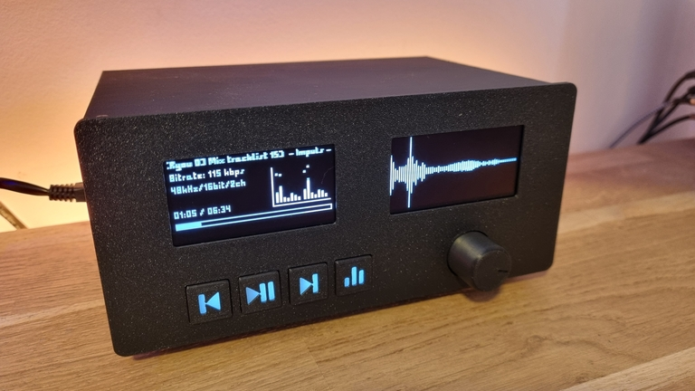
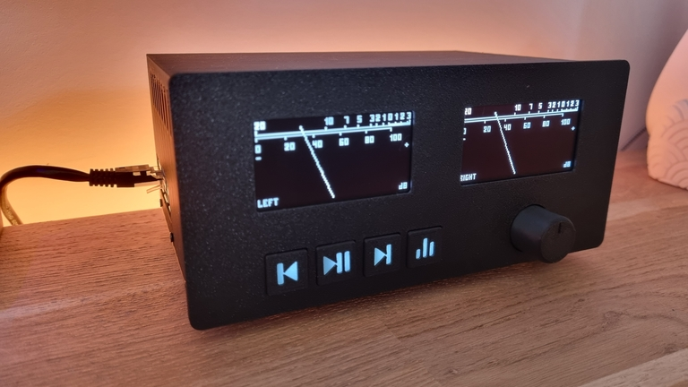
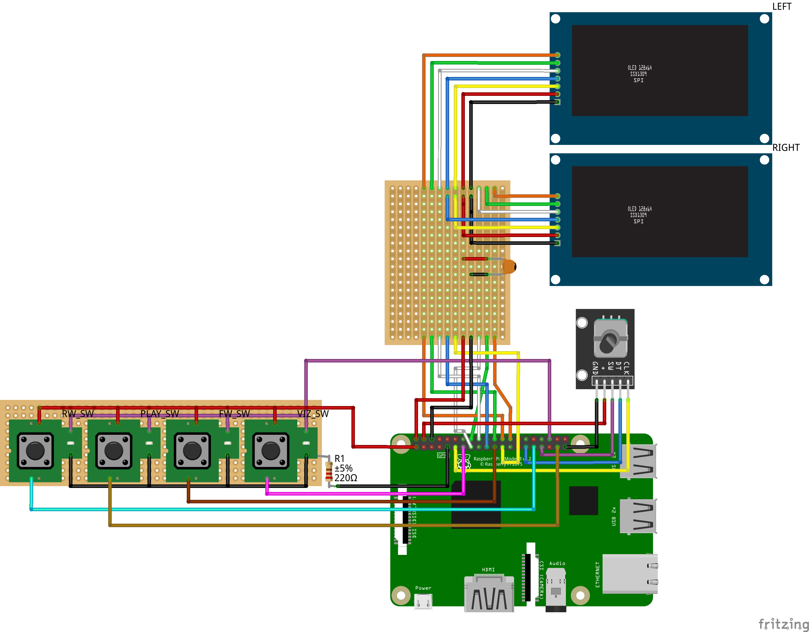

# Raspberry Audio Visualizer

A real-time stereo audio visualizer for Raspberry Pi that drives **two SSD1309 128×64 OLED displays** over SPI. Written in a single C++ file with a hardware abstraction layer that lets the same source build on both the **Raspberry Pi 5** (via `lgpio`) and the **Raspberry Pi 3B** (via `bcm2835`).

The project combines live FFT analysis of the system audio output, a full MPD client, Bluetooth (A2DP) metadata monitoring, and a small physical control surface (rotary encoder + four buttons) into a standalone "hi-fi display" appliance.
---

---

## Features

- **Six visualization modes**, switchable with a button or auto-cycled after 30 s of inactivity
- **Two independent OLEDs** — left and right channels rendered separately
- **Three-resolution FFT** (8192 / 2048 / 512 points) for accurate bass, mid, and treble bins
- **64-band and 7-band spectrum analyzers** with peak-hold, smoothing, and gravity decay
- **MPD integration** — now-playing info, play/pause, next/previous, volume, and a built-in album/track browser
- **Bluetooth A2DP monitoring** via BlueZ D-Bus — track metadata and auto-pause MPD on BT connect
- **FreeType text rendering** with small / regular / large sizes and UTF-8 support
- **Sleep mode** — after 10 s of silence, both displays fade out with a CRT-style shutdown animation; they wake when audio returns
- **Unified build** — one source file, two backends, selected at compile time with `-DUSE_BCM2835`

---

## Visualization Modes

| Mode | Description |
|---|---|
| **VU Meter** | Analog-style needle with logarithmic dB scale (−20 to +3 dB) |
| **Spectrum** | 7-band filled bars with peak markers and frequency labels (63 Hz → 16 kHz) |
| **Empty Spectrum** | Same 7 bands, outline-only style |
| **Waveform** | Time-domain oscilloscope trace |
| **Track Info** | Scrolling title, bitrate/format, elapsed/total time, progress bar, plus a 64-band mini-spectrum |
| **Playlist Editor** | Browse albums → tracks; play now or add to queue *(UI labels in French)* |

A short volume overlay is drawn over the current visualization whenever the rotary knob is turned.

{width=300px}

---
## Parts list
- 1 Raspberry pi 3B or 5
- 1 Rotary encoder 
- 2 128x64 waveshare SPI OLED screens white
- 4 momentary pushbuttons
- 4 smd1206 LEDs 6000k
- 1 100nF capacitor
- 1 220ohms resistor
- Board for screens
- 2*8cm Board for pushbuttons
- Optional: Audio HAT for RPI 5

---
## 3D printed parts
- M2.5 Threaded Insert
- M2.5×8mm screws
- Feet Stickers, 18 x 10 mm Rubber Pads Self Adhesive Half Sphere

---
## wiring



---
## Hardware

### Displays
- 2× SSD1309 OLED, 128×64, SPI mode

### GPIO Pinout (BCM numbering)

| Function | Pin | Function | Pin |
|---|---|---|---|
| Left display CS | 8 | Right display CS | 7 |
| Left display DC | 25 | Right display DC | 23 |
| Left display RST | 24 | Right display RST | 22 |
| Rotary CLK | 17 | Rotary DT | 5 |
| Rotary switch | 13 | Viz switch | 27 |
| Play/Pause button | 26 | Prev button | 6 |
| Next button | 9 | Power LED | 16 |

SPI runs at 10 MHz on the RPi 5 and ~6.25 MHz on the RPi 3B (stable without an extra decoupling cap).

### Controls

| Input | Action |
|---|---|
| Rotary knob | Volume ±2 (normal mode) / scroll list (editor mode) |
| Rotary push | Open Playlist Editor / confirm selection |
| Viz button | Cycle to next visualization / exit editor |
| Play button | Play / pause (MPD) |
| Next / Prev buttons | Skip track (MPD) |

---

## Dependencies

Common to both targets:

```
g++  pkg-config
libdbus-1-dev         # Bluetooth via BlueZ D-Bus
libasound2-dev        # ALSA capture
libfftw3-dev          # FFT (single-precision)
libfreetype-dev       # Text rendering
libmpdclient-dev      # MPD client
```

Plus **one** of:

- `liblgpio-dev` (Raspberry Pi 5)
- [`bcm2835`](https://www.airspayce.com/mikem/bcm2835/) library (Raspberry Pi 3B — install from source)

---

## Building

### Raspberry Pi 5 (lgpio backend)

```bash
sudo apt install g++ pkg-config libdbus-1-dev libasound2-dev \
                 libfftw3-dev libfreetype-dev libmpdclient-dev liblgpio-dev

g++ -o visualizer rav_unified.cpp \
    -O3 -march=native -std=c++23 \
    -I/usr/include/freetype2 \
    $(pkg-config --cflags --libs dbus-1) \
    -fstack-protector-strong -D_FORTIFY_SOURCE=2 -fPIE -pie -Wl,-z,relro,-z,now \
    -llgpio -lpthread -lasound -lfftw3f -lm -lfreetype -lmpdclient
```

### Raspberry Pi 3B (bcm2835 backend)

```bash
sudo apt install g++ pkg-config libdbus-1-dev libasound2-dev \
                 libfftw3-dev libfreetype-dev libmpdclient-dev
# Install bcm2835 from https://www.airspayce.com/mikem/bcm2835/

g++ -o visualizer rav_unified.cpp \
    -O3 -march=native -std=c++17 -DUSE_BCM2835 \
    -I/usr/include/freetype2 \
    $(pkg-config --cflags --libs dbus-1) \
    -fstack-protector-strong -D_FORTIFY_SOURCE=2 -fPIE -pie -Wl,-z,relro,-z,now \
    -lbcm2835 -lpthread -lasound -lfftw3f -lm -lfreetype -lmpdclient
```

The only difference is the `-DUSE_BCM2835` flag and the GPIO library. Everything else — the visualizations, MPD client, Bluetooth monitor, audio pipeline — is shared.

---

## Runtime Setup

### 1. ALSA loopback for audio capture

The visualizer opens an ALSA capture device named `rav` (falling back to `hw:Loopback,1`). The easiest way to feed it system audio is the kernel `snd-aloop` module:

```bash
sudo modprobe snd-aloop
# and make permanent in /etc/modules
```

Route your player (MPD, BT, etc.) to the loopback **playback** side; the visualizer reads the matching **capture** side. A named PCM called `rav` in `~/.asoundrc` or `/etc/asound.conf` pointing at the loopback capture device is the cleanest setup.

Audio is read as 44.1 kHz, 16-bit, stereo, 2048-frame periods.

### 2. MPD

MPD is expected on `localhost:6600` (hard-coded default in `MPDClient`). It connects in the background and will keep retrying until MPD is available, so boot order doesn't matter.

### 3. Fonts

At startup the program tries, in order:

1. `trixel-square.ttf` in the working directory
2. `/usr/share/fonts/truetype/dejavu/DejaVuSans.ttf`

Drop a `trixel-square.ttf` next to the binary for the intended pixel-font look, or rely on DejaVu as a fallback.

### 4. Bluetooth (optional)

If BlueZ is running, the visualizer subscribes to `PropertiesChanged` on `org.bluez.MediaPlayer1` / `MediaTransport1`. When a phone connects and starts A2DP playback, MPD is auto-paused and the displays switch to showing Bluetooth track metadata.

---

## Architecture

```
┌────────────────────────────────────────────────────────────┐
│                      VisualizerApp                         │
│                                                            │
│   ┌──────────────┐  ┌───────────────┐  ┌──────────────┐    │
│   │ AudioProcessor│  │   MPDClient   │  │  Bluetooth   │    │
│   │  (ALSA + 3×  │  │   (idle loop  │  │   Monitor    │    │
│   │   FFTW plans)│  │   thread)     │  │  (D-Bus thr) │    │
│   └──────┬───────┘  └──────┬────────┘  └──────┬───────┘    │
│          │                 │                  │            │
│          ▼                 ▼                  ▼            │
│   ┌────────────────────────────────────────────────────┐   │
│   │               Visualization (×6)                   │   │
│   │      VU / Spectrum / Waveform / Track / Editor     │   │
│   └─────────────────────┬──────────────────────────────┘   │
│                         ▼                                  │
│   ┌─────────────────┐       ┌─────────────────┐            │
│   │  Display LEFT   │       │  Display RIGHT  │            │
│   └────────┬────────┘       └────────┬────────┘            │
│            ▼                         ▼                     │
│   ┌────────────────────────────────────────────┐           │
│   │       HardwareLayer (abstract)             │           │
│   │   ├── LGpioBackend   (RPi 5, interrupts)   │           │
│   │   └── BCM2835Backend (RPi 3B, polling)     │           │
│   └────────────────────────────────────────────┘           │
└────────────────────────────────────────────────────────────┘
```

### Threads

| Thread | Role |
|---|---|
| Main | Rendering loop (~60 FPS), input polling, sleep/wake state machine |
| Audio | Blocking ALSA reads → circular buffer |
| MPD | `mpd_send_idle` loop + periodic bitrate refresh |
| Bluetooth | D-Bus message dispatch |
| Rotary poll (RPi 3B only) | 1 kHz GPIO polling (RPi 5 uses `lgpio` alerts/IRQ instead) |
| Editor load | Async album/track fetch from MPD, so the UI never blocks |

### Audio pipeline

1. ALSA captures 2048-frame stereo periods at 44.1 kHz.
2. Samples land in a circular buffer sized `2 × 8192`.
3. Three FFTW plans run in parallel on Hann-windowed slices:
   - **Bass** (8192 pts) for the low bands — fine frequency resolution
   - **Mid** (2048 pts) for mid-range bands
   - **Treble** (512 pts) for high bands — fast response
4. Each output bin is energy-summed into a freq band, multiplied by a per-band correction curve, then smoothed with an integral filter + gravity decay before being clamped to 0–255 for display.

This tri-resolution approach gives low-latency treble without sacrificing bass precision — a trick borrowed from projects like `cava`.

### Sleep mode

A silence-detector watches peak amplitude. After 10 s below threshold the app runs a CRT-collapse animation on both screens (vertical pinch → horizontal line → blank), puts the SSD1309s into sleep command `0xAE`, and turns off the power LED. Any audio above threshold (or any button press) reverses the animation and resumes rendering.

---

## Project Layout

A single translation unit, roughly organized as:

```
rav_unified.cpp
├── Config             — pin map, SPI, screen constants
├── HardwareLayer      — abstract class + LGpio / BCM2835 backends
├── MPDClient          — connection, metadata, control, library queries
├── BluetoothMonitor   — BlueZ D-Bus listener
├── FontManager        — FreeType wrapper, UTF-8 decoder
├── Display            — SSD1309 driver + framebuffer primitives
├── AudioProcessor     — ALSA capture + 3× FFTW analysis
├── TextScroller       — ping-pong marquee
├── Visualization      — base class
│   ├── VUMeterViz
│   ├── SpectrumViz / EmptySpectrumViz
│   ├── WaveformViz
│   ├── TrackInfoViz
│   └── PlaylistEditorViz
├── RotaryEncoder      — interrupt-driven (lgpio) or polled (bcm2835)
└── VisualizerApp      — wiring, main loop, CRT animation, sleep logic
```

---

## Running

```bash
# Usually needs root for GPIO/SPI access (or appropriate udev rules / groups)
sudo ./visualizer
```

`SIGINT` / `SIGTERM` triggers a clean shutdown: threads are joined, displays cleared and put to sleep, GPIO released.

---

## Notes & Tweaks

- **Frame rate** is capped at ~60 FPS (16 ms frame time) in `VisualizerApp::run()`.
- **Auto-cycle interval** is 30 s idle then cycles every `CYCLE_INTERVAL` frames (`= 36000`, ~10 min at 60 FPS).
- **Sensitivity / noise reduction** can be adjusted via `AudioProcessor::setSensitivity(10–300)` and `setNoiseReduction(0–100)`.
- **MPD host/port** are hard-coded in `MPDClient`'s constructor (`localhost:6600`); change there if needed.
- **GPIO chip number** defaults to `4` (RPi 5) with a fallback to `0` (older Pis running lgpio).

## Inspirations
- CAVA: https://github.com/karlstav/cava
- VU_meter: https://github.com/adamples/VU_meter/
- Digital VU Meter with Analog Physics: https://hackaday.io/project/181004-digital-vu-meter-with-analog-physics
